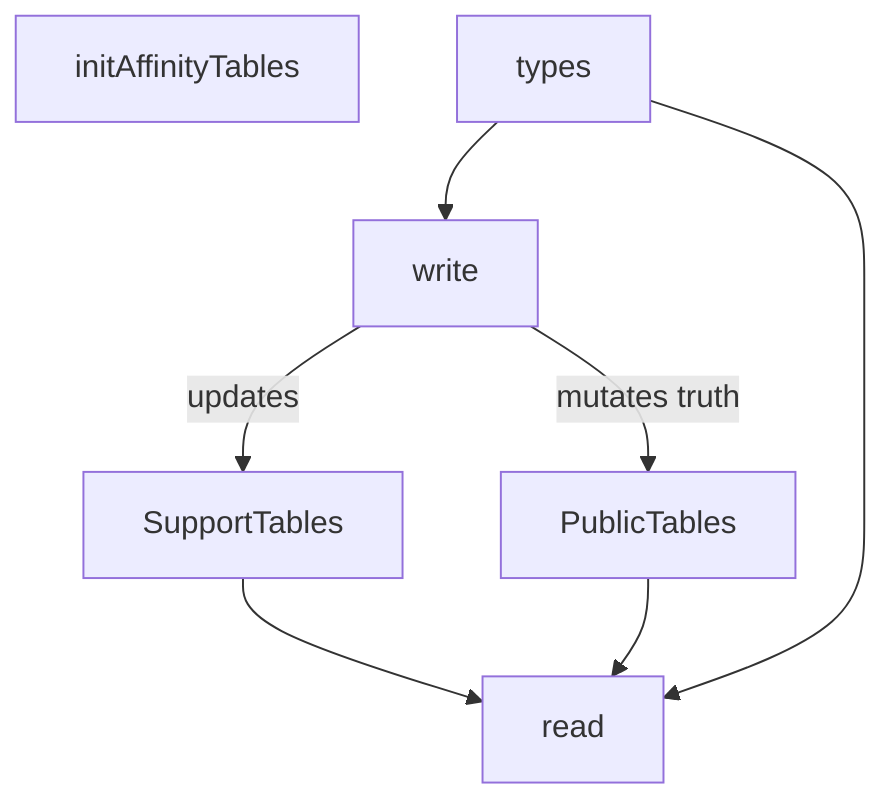
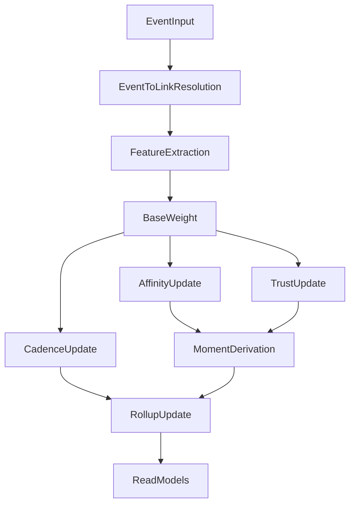

# Standalone Social CRM Core

Canonical concept file for `Affinity`, a standalone singleplayer social CRM core
for:

1. personal contact management
2. solo-business CRM
3. hybrid life CRM
4. later Ghostpaw integration

This file is the authoritative specification for the product grammar, human
direct-code package surface, data model, mechanics, and acceptance bar.

## Purpose

`Affinity` is not a toy social layer. It is a real standalone CRM whose surface
should feel RPG-native while its internals remain explicit, calculable, and
SQL-grounded.

The design target is:

- emotionally legible like a relationship system in an RPG
- operationally useful like a serious solo CRM
- mechanically explicit in code and SQL
- coherent enough to stand alone without Ghostpaw context

If it only feels like a CRM, it loses its relational magic.
If it only feels like a game, it fails as a serious tool.
It must do both.

## Product Grammar

The visible system name is `Affinity`.

| Technical term | Visible name | Meaning |
|---|---|---|
| system | `Affinity` | overall subsystem or product |
| `contacts` | `Contact` | any tracked entity |
| `links` | `Link` | umbrella noun for a relationship row |
| relational `links` | `Social Link` | owner-facing or observed relationship track |
| structural `links` | `Tie` | family, work, membership, hierarchy, affiliation edge |
| `links.rank` | `Rank` | visible progression level |
| `links.affinity` | `Affinity` | hidden progress toward next rank |
| `links.trust` | `Trust` | reliability / confidence axis |
| `links.bond` | `Bond` | current narrative reading of the link |
| `events` | `Journal` entry | ordinary history record |
| `events.moment_kind` | `Moment` | relationship-defining beat |
| derived world graph | `Affinity Chart` | relationship map |
| derived maintenance | `Radar` | drift, reminders, duplicates, resurfacing |

Natural language should sound like:

- "Add this as a contact."
- "Record that we had dinner."
- "Show my social link with Alice."
- "That moment probably raised the rank."
- "Their bond feels strained right now."
- "Check radar for drift and upcoming birthdays."

Terms to avoid as the main grammar:

- `Confidant` as the universal base noun
- `Bond` as the name of every link row
- `Relationship` as the primary visible noun
- `Support` as the universal system noun
- `Patrol` as the main maintenance surface

`Confidant` remains a strong optional earned label for deep personal human
links, but not the universal noun for every tracked entity.

## Product Target Requirements

The system must rival the core of serious PRM/CRM tools and the motivating
mechanics of relationship-heavy RPGs, excluding integrations.

| Category | Required coverage |
|---|---|
| entity | humans, groups, households, teams, companies, services, bots, pets, owner as first-class contact |
| identity | email, phone, websites, handles, account IDs, aliases, multi-identity, exact and fuzzy resolution |
| relationship | owner-to-contact social links, observed third-party links, structural ties, multiple links between same pair, visible rank, hidden affinity, trust, state, cadence, bond |
| history | conversations, observations, gifts, conflicts, corrections, milestones, activities, transactions, promises, agreements, recurring important dates |
| CRM | tags, custom fields, segmentation, duplicate detection, deterministic merges, reminders, keep-in-touch |
| RPG | visible progression, hidden accumulation, threshold moments, relationship states, preference-sensitive interaction, graph visibility |

## Operation Philosophy

The human direct-code API is the primary contract in this pass.

Hard rules:

- store entities, identities, evidence, participation, relationships, and
  metadata separately
- derive relationship state from evidence plus explicit overrides
- expose intention-shaped writes, not generic CRUD
- keep list reads compact and detail reads explanatory
- allow manual overrides only as explicit exceptional operations
- never require callers to directly write `rank`, `affinity`, `trust`,
  `moment_kind`, drift, readiness, or derived maintenance scores

The system preserves these separations:

1. entity is not relationship
2. identity is not entity
3. event is not participation
4. structural is not relational
5. evidence is not interpretation
6. metadata is not meaning
7. maintenance is not source data
8. trust is not progress

This API exists so the caller can say what happened in socially legible terms,
while the system owns the internal math and consistency.

## Package Surface

The only public package surface in this pass is:

```ts
import { initAffinityTables, read, types, write } from "@ghostpaw/affinity";
```

| Export | Responsibility |
|---|---|
| `initAffinityTables(db)` | initialize public schema and required internal support tables |
| `write.*` | intention-shaped mutations that may atomically touch multiple tables |
| `read.*` | compact and detailed derived views |
| `types.*` | stable TypeScript contracts for app code |

The public mental model is:



## Package Layout

`Affinity` should mirror the sharp package mechanics of `questlog`, but without
the LLM-oriented layers in v1.

### Package decisions

| Area | Decision |
|---|---|
| runtime | Node `24.14.0`, using built-in `node:sqlite` only |
| package type | ESM package with dual ESM/CJS output |
| runtime dependencies | zero |
| publish surface | single root export only; no subpath exports |
| built files | `dist/index.js`, `dist/index.cjs`, `dist/index.d.ts`, `dist/index.d.cts` |
| source entry | `src/index.ts` |
| schema entry | `src/init_affinity_tables.ts` |
| human API barrels | `src/read.ts`, `src/write.ts`, `src/types.ts`, `src/errors.ts` |
| build tool | `tsup` |
| typecheck | `tsc --noEmit` |
| formatting and lint | `biome` |
| test runner | `node --experimental-strip-types --test` |
| packaging rule | `package.json files = [\"dist\"]` |

### Top-level repository layout

The repository should be as small and legible as `questlog`:

```text
affinity/
  .github/
    workflows/
      ci.yml
      publish.yml
  docs/
    README.md
    HUMAN.md
    entities/
  src/
  .gitignore
  .node-version
  .nvmrc
  .tool-versions
  biome.json
  mise.toml
  package-lock.json
  package.json
  tsconfig.json
  tsup.config.ts
  README.md
  LICENSE
```

### Source layout

The source tree should stay close to `questlog`'s shape: a small root with a
few package-level files, plus concept folders underneath.

```text
src/
  index.ts
  index.test.ts
  database.ts
  init_affinity_tables.ts
  init_affinity_tables.test.ts
  read.ts
  read.test.ts
  write.ts
  write.test.ts
  types.ts
  errors.ts
  with_transaction.ts
  with_transaction.test.ts
  resolve_now.ts
  resolve_now.test.ts
  lib/
  contacts/
  identities/
  links/
  events/
  attributes/
  dates/
  merges/
```

Layout rules:

- package-level root files exist only for cross-cutting public assembly,
  database/runtime plumbing, shared transactions, and package entrypoints
- feature logic lives in concept folders, not in type-based global bins
- every non-type module has a colocated `.test.ts`
- concept folders expose their own `index.ts` barrel if they have multiple
  internal files

### Human-facing docs layout

Because there is no LLM layer yet, the docs layout should be simpler than
`questlog`:

```text
docs/
  README.md
  HUMAN.md
  entities/
    CONTACTS.md
    IDENTITIES.md
    LINKS.md
    EVENTS.md
    ATTRIBUTES.md
```

Doc roles:

- root `README.md`: package pitch, install, quick start, package surface
- `docs/README.md`: architecture, invariants, lifecycle, mechanics summary
- `docs/HUMAN.md`: direct-code usage guide with worked examples
- `docs/entities/*`: concept manuals with exact public API listings for each
  area

### `package.json` contract

The package should follow the same sharp contract as `questlog`:

- `type: "module"`
- one root `exports["."]` entry only
- dual `import` and `require` targets
- `main`, `module`, and `types` pointing at `dist`
- `files = ["dist"]`
- `sideEffects = false`
- `engines.node = ">=24"`
- `publishConfig.access = "public"`
- `volta.node = "24.14.0"`

Scripts:

- `build`
- `dev`
- `test`
- `lint`
- `lint:fix`
- `format`
- `typecheck`
- `check`
- `clean`
- `prepublishOnly`
- `release:patch`
- `release:minor`
- `release:major`

### Build and type configuration

`tsconfig.json` should match the same runtime assumptions:

- `target = ES2024`
- `module = Preserve`
- `moduleResolution = Bundler`
- `lib = ["ES2024"]`
- `rootDir = "src"`
- `outDir = "dist"`
- `noEmit = true`
- `allowImportingTsExtensions = true`
- strict mode and exact optional semantics enabled
- explicit `.ts` imports preserved via `verbatimModuleSyntax`

`tsup.config.ts` should stay minimal:

- `entry = ["src/index.ts"]`
- `format = ["esm", "cjs"]`
- `dts = true`
- `clean = true`
- `target = "node24"`
- `splitting = false`
- `sourcemap = false`
- `treeshake = true`

### CI and release workflow

The package should use the same two-workflow pattern as `questlog`.

`ci.yml`:

- run on pushes to `main` and pull requests
- `actions/checkout`
- `actions/setup-node` via `.nvmrc`
- `npm ci`
- `npm run check`
- `npm run test`
- `npm run build`
- `npm pack --dry-run`
- package size guard on `dist`

`publish.yml`:

- run on version tags `v*`
- `actions/checkout`
- `actions/setup-node` via `.nvmrc`
- `npm ci`
- `npm run check`
- `npm run test`
- `npm run build`
- verify `package.json` version matches tag
- `npm pack --dry-run`
- `npm publish --provenance`
- create GitHub release notes automatically

### Deliverables

The first complete package deliverable set is:

- installable npm package with dual ESM/CJS outputs
- root direct-code API: `initAffinityTables`, `read`, `write`, `types`
- strict Node 24 + embedded SQLite runtime only
- no runtime dependencies
- full colocated test coverage
- compact human docs set
- CI + publish workflows

## Error Model

Invalid domain operations throw typed errors. Normal absence in reads does not
throw.

| Error | Meaning | Examples |
|---|---|---|
| `AffinityNotFoundError` | referenced thing does not exist | missing contact, link, identity, event, anchor |
| `AffinityConflictError` | uniqueness or ownership collision | duplicate identity, second owner, conflicting reassignment |
| `AffinityInvariantError` | attempted state would violate model truth | progression fields on structural tie, multiple owners |
| `AffinityValidationError` | malformed or out-of-range input | invalid significance, invalid recurrence, unsupported sort |
| `AffinityMergeError` | merge request is illegal or ambiguous | merge into self, merge merged row, unresolved identity conflict |
| `AffinityStateError` | forbidden lifecycle or relationship transition | invalid `links.state` or `contacts.lifecycle_state` change |

Non-throw rules:

- list reads return arrays, possibly empty
- detail reads return record or `null` when absence is normal
- throws are for invalid or impossible operations, not for empty result sets

## Shared Result Shapes

### Common refs

```ts
type EntityRef =
  | { kind: "contact"; id: number }
  | { kind: "identity"; id: number }
  | { kind: "link"; id: number }
  | { kind: "event"; id: number }
  | { kind: "attribute"; id: number };
```

### Read records

| Record | Purpose |
|---|---|
| `ContactListItem` | compact portfolio row for listings and search |
| `ContactProfileRecord` | full contact detail with identities, attributes, top links, rollups |
| `IdentityRecord` | one identity attached to a contact |
| `LinkListItem` | compact social or structural link row |
| `LinkDetailRecord` | full link detail with current mechanics and recent history |
| `EventRecord` | one Journal entry with participants |
| `MomentRecord` | one derived key beat |
| `RadarRecord` | one maintenance candidate row |
| `UpcomingDateRecord` | one upcoming anchored date |
| `DuplicateCandidateRecord` | one dedupe candidate pair |
| `CommitmentRecord` | one unresolved or resolved promise/agreement projection |
| `MergeHistoryRecord` | one merge lineage entry |
| `AffinityChartRecord` | graph projection of nodes and weighted edges |

Minimum required fields:

| Record | Required fields |
|---|---|
| `ContactListItem` | `id`, `name`, `kind`, `lifecycleState`, `isOwner`, optional `primaryIdentity`, optional `lastMeaningfulEventAt` |
| `ContactProfileRecord` | `contact`, `identities`, `attributes`, `topLinks`, `activeDates`, `warnings`, optional `rollups` |
| `IdentityRecord` | `id`, `contactId`, `type`, `value`, `label`, `verified` |
| `LinkListItem` | `id`, `fromContactId`, `toContactId`, `kind`, optional `role`, optional `rank`, optional `affinity`, optional `trust`, optional `state`, optional `cadenceDays`, optional `bond` |
| `LinkDetailRecord` | `link`, `counterparty`, `recentEvents`, `moments`, optional `rollups`, optional `derivation` |
| `EventRecord` | `id`, `type`, `occurredAt`, `summary`, `significance`, `momentKind`, `participants` |
| `MomentRecord` | `eventId`, `linkId`, `momentKind`, `occurredAt`, `summary`, `impactScore` |
| `RadarRecord` | `linkId`, `contactId`, `driftPriority`, `recencyScore`, `normalizedRank`, `trust`, `recommendedReason` |
| `UpcomingDateRecord` | `anchorEventId`, `targetRef`, `recurrenceKind`, `occursOn`, `summary`, `significance` |
| `DuplicateCandidateRecord` | `leftContactId`, `rightContactId`, `matchReason`, `matchScore` |
| `CommitmentRecord` | `eventId`, `type`, `summary`, `participants`, optional `dueAt`, `resolutionState` |
| `MergeHistoryRecord` | `winnerContactId`, `loserContactId`, `mergedAt`, optional `reasonSummary`, `manual` |
| `AffinityChartRecord` | `nodes`, `edges` |

### Write receipts

All writes return a receipt family with the same top-level shape:

```ts
interface MutationReceipt<TPrimary> {
  primary: TPrimary;
  created: EntityRef[];
  updated: EntityRef[];
  archived: EntityRef[];
  removed: EntityRef[];
  affectedLinks: number[];
  derivedEffects: DerivedLinkEffect[];
}
```

Receipt families:

- `ContactMutationReceipt`
- `IdentityMutationReceipt`
- `LinkMutationReceipt`
- `EventMutationReceipt`
- `AttributeMutationReceipt`
- `MergeReceipt`

`derivedEffects` contains link-level math already computed by the system.

Required receipt behavior:

- `primary` is always the operator-facing main result of the call
- `created`, `updated`, `archived`, and `removed` use stable `EntityRef`
  ordering by mutation time inside the transaction
- `affectedLinks` includes every relational link whose mechanics changed
- `derivedEffects` includes one row per affected relational link
- non-mechanical writes may return `derivedEffects = []`

## Write API

Each write contract below states:

- what the caller provides
- what the caller is forbidden to provide
- which tables may change
- what internal support may change
- what the receipt returns
- which typed errors may be thrown

### Write namespace summary

```ts
write.createContact(db, input)
write.reviseContact(db, contactId, patch)
write.setContactLifecycle(db, contactId, lifecycleState, options?)

write.addIdentity(db, contactId, input)
write.reviseIdentity(db, identityId, patch)
write.verifyIdentity(db, identityId, verifiedAt?)
write.removeIdentity(db, identityId, removedAt?)

write.setStructuralTie(db, input)
write.removeStructuralTie(db, tieId, removedAt?)

write.seedSocialLink(db, input)
write.overrideLinkState(db, linkId, state, options?)
write.reviseBond(db, linkId, bond, options?)

write.recordInteraction(db, input)
write.recordObservation(db, input)
write.recordMilestone(db, input)
write.recordTransaction(db, input)
write.recordCommitment(db, input)
write.resolveCommitment(db, commitmentEventId, resolution, options?)

write.addDateAnchor(db, input)
write.reviseDateAnchor(db, anchorEventId, patch)
write.removeDateAnchor(db, anchorEventId, removedAt?)

write.setAttribute(db, target, name, value)
write.unsetAttribute(db, target, name)
write.replaceAttributes(db, target, entries)

write.mergeContacts(db, input)
```

### 1. Contact formation and lifecycle

#### `write.createContact(db, input)`

Creates a new contact row and optional intrinsic profile fields.

| Contract | Value |
|---|---|
| caller provides | `name`, `kind`, optional intrinsic profile fields |
| caller forbidden | `rank`, `trust`, `affinity`, link data, raw lifecycle other than default bootstrap |
| public tables | `contacts` |
| support tables | none required |
| returns | `ContactMutationReceipt` with `primary` as compact contact projection |
| throws | `AffinityValidationError`, `AffinityConflictError`, `AffinityInvariantError` |

Rules:

- `is_owner` may only be set during explicit owner bootstrap mode
- owner bootstrap may happen exactly once
- intrinsic profile fields must remain contact-intrinsic, never relationship-specific

#### `write.reviseContact(db, contactId, patch)`

Revises contact-intrinsic fields only.

| Contract | Value |
|---|---|
| caller provides | patch for intrinsic contact fields |
| caller forbidden | identity changes, ties, mechanics, event history rewrites |
| public tables | `contacts` |
| support tables | optional `contact_rollups` refresh |
| returns | `ContactMutationReceipt` |
| throws | `AffinityNotFoundError`, `AffinityStateError`, `AffinityValidationError` |

Rules:

- may update `name`, intrinsic profile fields, and non-derived lifecycle-adjacent
  metadata
- may not edit identities, ties, relationship mechanics, or event history
- merged contacts are read-only and throw `AffinityStateError`

#### `write.setContactLifecycle(db, contactId, lifecycleState, options?)`

Changes `contacts.lifecycle_state` explicitly.

| Contract | Value |
|---|---|
| caller provides | `contactId`, target lifecycle state, optional provenance |
| public tables | `contacts`, possibly `links` when cascade rules apply |
| support tables | rollups when visibility changes |
| returns | `ContactMutationReceipt` |
| throws | `AffinityNotFoundError`, `AffinityStateError`, `AffinityInvariantError` |

| From | To | Allowed by | Effect |
|---|---|---|---|
| `active` | `dormant` | manual or long inactivity policy | remains queryable, excluded from some default active views |
| `dormant` | `active` | manual or new evidence | normal visibility resumes |
| `active` / `dormant` | `merged` | deterministic merge only | contact becomes read-only |
| `active` / `dormant` | `lost` | manual invalidation | suppressed from default active views |
| `lost` | `active` | manual recovery | re-enabled |

`merged` is terminal and normally reached only through `write.mergeContacts()`.

### 2. Identity management

#### `write.addIdentity(db, contactId, input)`

Attaches one recognition or routing identity.

| Contract | Value |
|---|---|
| caller provides | `type`, `value`, optional `label`, optional `verified` |
| caller forbidden | direct normalized-key values, merge lineage writes |
| public tables | `identities` |
| support tables | normalized identity index |
| returns | `IdentityMutationReceipt` |
| throws | `AffinityNotFoundError`, `AffinityConflictError`, `AffinityValidationError` |

Rules:

- identity normalization and collision checks happen before insert
- one normalized identity may belong to one live contact only
- collisions throw `AffinityConflictError`, not silent reassignment

#### `write.reviseIdentity(db, identityId, patch)`

Updates label, raw value, or type, re-running normalization and collision checks.

| Contract | Value |
|---|---|
| caller provides | patch for `type`, `value`, `label` |
| public tables | `identities` |
| support tables | normalized identity index |
| returns | `IdentityMutationReceipt` |
| throws | `AffinityNotFoundError`, `AffinityConflictError`, `AffinityValidationError` |

#### `write.verifyIdentity(db, identityId, verifiedAt?)`

Marks `verified = true`. This is provenance only. It does not change trust.

| Contract | Value |
|---|---|
| caller provides | `identityId`, optional verification timestamp |
| public tables | `identities` |
| support tables | none required |
| returns | `IdentityMutationReceipt` |
| throws | `AffinityNotFoundError` |

#### `write.removeIdentity(db, identityId, removedAt?)`

Removes one identity from the live routing surface.

Rules:

- removing the last reachable endpoint is allowed
- reads may still show a warning in `ContactProfileRecord`
- merge lineage must keep historical reassignment truth even after removal

| Contract | Value |
|---|---|
| caller provides | `identityId`, optional removal timestamp |
| public tables | `identities` |
| support tables | normalized identity index |
| returns | `IdentityMutationReceipt` |
| throws | `AffinityNotFoundError` |

### 3. Structural tie management

#### `write.setStructuralTie(db, input)`

Creates or updates a structural `links` row.

| Contract | Value |
|---|---|
| caller provides | `fromContactId`, `toContactId`, `kind`, optional `role` |
| caller forbidden | `rank`, `affinity`, `trust`, `state`, `cadenceDays`, `bond` |
| public tables | `links` |
| support tables | none required |
| returns | `LinkMutationReceipt` |
| throws | `AffinityNotFoundError`, `AffinityValidationError`, `AffinityInvariantError` |

Rules:

- structural ties may coexist with relational links between the same pair
- structural ties never carry progression columns
- duplicate structural links of the same `(from, to, kind, role)` should resolve
  to update-or-no-op, not duplicate rows

#### `write.removeStructuralTie(db, tieId, removedAt?)`

Archives or removes one structural tie from active surfaces.

| Contract | Value |
|---|---|
| caller provides | `tieId`, optional removal timestamp |
| public tables | `links` |
| support tables | none required |
| returns | `LinkMutationReceipt` |
| throws | `AffinityNotFoundError`, `AffinityInvariantError` |

### 4. Relational seed and override path

#### `write.seedSocialLink(db, input)`

Creates a relational link without recording a new event.

Use only for:

- imports
- manual initial portfolio seeding
- migration from another system

Never use it for ordinary social evidence that should flow through Journal
entries.

| Contract | Value |
|---|---|
| caller provides | `fromContactId`, `toContactId`, `kind`, optional initial `rank`, `affinity`, `trust`, `state`, `cadenceDays`, `bond` |
| caller forbidden | direct `momentKind`, link effect rows |
| public tables | `links` |
| support tables | optional `link_rollups` seed |
| returns | `LinkMutationReceipt` |
| throws | `AffinityNotFoundError`, `AffinityValidationError`, `AffinityInvariantError` |

Rules:

- initial seeded mechanics are allowed only here
- seeded values must obey relational ranges and transition rules
- this does not backfill synthetic Journal entries

#### `write.overrideLinkState(db, linkId, state, options?)`

Explicitly changes `links.state`.

Rules:

- valid only for relational links
- override provenance must be recorded
- override changes state, may change maintenance visibility, but does not invent
  synthetic affinity or trust deltas

| Contract | Value |
|---|---|
| caller provides | `linkId`, target `state`, optional provenance |
| public tables | `links` |
| support tables | `link_rollups` |
| returns | `LinkMutationReceipt` |
| throws | `AffinityNotFoundError`, `AffinityStateError`, `AffinityInvariantError` |

#### `write.reviseBond(db, linkId, bond, options?)`

Manually rewrites the narrative reading of a relational link.

Rules:

- bond is interpretation, not evidence
- revising bond does not alter trust, rank, affinity, or cadence directly

| Contract | Value |
|---|---|
| caller provides | `linkId`, new bond text, optional provenance |
| public tables | `links` |
| support tables | none required |
| returns | `LinkMutationReceipt` |
| throws | `AffinityNotFoundError`, `AffinityInvariantError` |

### 5. Social evidence intake

All evidence writes share one common input family.

#### Shared social event input

```ts
interface SocialEventInput {
  occurredAt: number;
  summary: string;
  significance: number; // 1..10
  participants: readonly {
    contactId: number;
    role: "actor" | "recipient" | "subject" | "observer" | "mentioned";
    directionality?: "owner_initiated" | "other_initiated" | "mutual" | "observed";
  }[];
  provenance?: unknown;
}
```

Caller-forbidden fields for all evidence writes:

- `affinity`
- `trust`
- `rank`
- `state`
- `momentKind`
- direct `link_event_effects`

#### `write.recordInteraction(db, input)`

Direct social evidence between owner and one or more other contacts.

| Contract | Value |
|---|---|
| event types | `conversation`, `activity`, `gift`, `support`, `conflict`, `correction` |
| public tables | `events`, `event_participants`, possibly `links` |
| support tables | `link_event_effects`, `link_rollups`, `contact_rollups` |
| returns | `EventMutationReceipt` |
| throws | `AffinityNotFoundError`, `AffinityValidationError`, `AffinityInvariantError`, `AffinityStateError` |

Rules:

- owner + one non-owner affects owner -> contact relational link
- owner + many non-owners affects owner -> each non-owner relational link
- no automatic peer links are inferred between non-owner participants
- if owner and one non-owner co-occur in a direct event and no relational link
  exists, create one

#### `write.recordObservation(db, input)`

Third-party or low-directness social evidence.

Rules:

- no owner + two non-owners may create one `observed` link
- no owner + three or more non-owners never creates a clique
- only explicitly referenced existing links may be affected in group observation
  cases
- observational evidence is weaker through lower `directness`

| Contract | Value |
|---|---|
| event types | `observation` |
| public tables | `events`, `event_participants`, possibly `links` |
| support tables | `link_event_effects`, rollups |
| returns | `EventMutationReceipt` |
| throws | `AffinityNotFoundError`, `AffinityValidationError`, `AffinityInvariantError` |

#### `write.recordMilestone(db, input)`

Records milestone events such as anniversaries, breakpoints, promotions,
engagements, or notable life changes.

Rules:

- milestone writes still flow through the same event pipeline
- milestone significance may derive `moment_kind = milestone`

| Contract | Value |
|---|---|
| event types | `milestone` |
| public tables | `events`, `event_participants`, possibly `links` |
| support tables | `link_event_effects`, rollups |
| returns | `EventMutationReceipt` |
| throws | `AffinityNotFoundError`, `AffinityValidationError`, `AffinityInvariantError` |

#### `write.recordTransaction(db, input)`

Records commercially or operationally meaningful interactions.

Rules:

- valid for personal, professional, and service links
- may change trust and cadence, but usually weakly affects affinity

| Contract | Value |
|---|---|
| event types | `transaction` |
| public tables | `events`, `event_participants`, possibly `links` |
| support tables | `link_event_effects`, rollups |
| returns | `EventMutationReceipt` |
| throws | `AffinityNotFoundError`, `AffinityValidationError`, `AffinityInvariantError` |

### 6. Commitments and dates

#### `write.recordCommitment(db, input)`

Records a `promise` or `agreement` event and opens unresolved commitment state.

| Contract | Value |
|---|---|
| caller provides | shared social event input plus `commitmentType`, optional `dueAt`, optional resolution expectations |
| public tables | `events`, `event_participants` |
| support tables | `open_commitments`, `link_event_effects`, rollups |
| returns | `EventMutationReceipt` |
| throws | `AffinityNotFoundError`, `AffinityValidationError`, `AffinityInvariantError` |

Rules:

- public commitment truth is still an event row
- unresolved operational state lives in internal support only

#### `write.resolveCommitment(db, commitmentEventId, resolution, options?)`

Closes an open commitment as `kept`, `cancelled`, or `broken`.

Rules:

- resolution may optionally record a linked resolving event
- broken commitments affect trust through `violation_factor`
- resolved commitments disappear from `read.listOpenCommitments()`

| Contract | Value |
|---|---|
| caller provides | `commitmentEventId`, resolution enum, optional linked resolving event data |
| public tables | optional new `events`, `event_participants` |
| support tables | `open_commitments`, `link_event_effects`, rollups |
| returns | `EventMutationReceipt` |
| throws | `AffinityNotFoundError`, `AffinityStateError`, `AffinityValidationError` |

#### `write.addDateAnchor(db, input)`

Creates an anchored recurring event for birthday, anniversary, renewal,
memorial, or custom yearly date.

| Contract | Value |
|---|---|
| caller provides | target contact or link, `recurrenceKind`, `anchorMonth`, `anchorDay`, `summary`, `significance` |
| public tables | `events`, `event_participants` |
| support tables | `upcoming_occurrences` |
| returns | `EventMutationReceipt` |
| throws | `AffinityNotFoundError`, `AffinityValidationError`, `AffinityConflictError` |

Rules:

- anchor rows are `events` with recurrence metadata, not a separate public table
- duplicate yearly anchors of the same kind on the same target should conflict
  unless explicitly forced

#### `write.reviseDateAnchor(db, anchorEventId, patch)`

Updates recurrence metadata on an anchored recurring event.

| Contract | Value |
|---|---|
| caller provides | recurrence patch fields and optional summary/significance patch |
| public tables | `events` |
| support tables | `upcoming_occurrences` |
| returns | `EventMutationReceipt` |
| throws | `AffinityNotFoundError`, `AffinityValidationError`, `AffinityConflictError` |

#### `write.removeDateAnchor(db, anchorEventId, removedAt?)`

Archives or removes one anchored recurring event from the active date surface.

| Contract | Value |
|---|---|
| caller provides | anchor event id, optional removal timestamp |
| public tables | `events` |
| support tables | `upcoming_occurrences` |
| returns | `EventMutationReceipt` |
| throws | `AffinityNotFoundError` |

### 7. Metadata and preferences

#### `write.setAttribute(db, target, name, value)`

Sets one contact-targeted or link-targeted attribute.

| Contract | Value |
|---|---|
| caller provides | target ref, namespaced `name`, string or `NULL` value |
| public tables | `attributes` |
| support tables | none required |
| returns | `AttributeMutationReceipt` |
| throws | `AffinityNotFoundError`, `AffinityValidationError` |

#### `write.unsetAttribute(db, target, name)`

Removes one attribute.

| Contract | Value |
|---|---|
| caller provides | target ref, namespaced `name` |
| public tables | `attributes` |
| support tables | none required |
| returns | `AttributeMutationReceipt` |
| throws | `AffinityNotFoundError` |

#### `write.replaceAttributes(db, target, entries)`

Replaces the visible attribute set for a target.

Rules:

- exactly one of `contactId` or `linkId` is targeted
- `NULL` value represents presence/tag semantics
- preference-sensitive formulas consume explicit namespaced keys such as
  `pref.channel.text`, `pref.activity.walk`, `pref.link.channel.email`

| Contract | Value |
|---|---|
| caller provides | target ref and full replacement entry set |
| public tables | `attributes` |
| support tables | none required |
| returns | `AttributeMutationReceipt` |
| throws | `AffinityNotFoundError`, `AffinityValidationError` |

### 8. Reconciliation and merge

#### `write.mergeContacts(db, input)`

Merges one losing contact into one winning contact.

| Contract | Value |
|---|---|
| caller provides | `winnerContactId`, `loserContactId`, optional reason summary |
| public tables | `contacts`, `identities`, `links`, `events`, `event_participants`, `attributes` |
| support tables | `contact_merges`, normalized identity index, rollups |
| returns | `MergeReceipt` |
| throws | `AffinityMergeError`, `AffinityConflictError`, `AffinityInvariantError`, `AffinityNotFoundError` |

Rules:

- merge into self is forbidden
- merged contacts cannot be merged again as winners
- owner merge rules must preserve exactly one owner
- identities, participant refs, attributes, and live links must be rewired in
  one transaction
- merge lineage must always be preserved

## Read API

Reads return derived truth. A caller should not need to stitch raw `contacts`,
`links`, `events`, `event_participants`, and support tables into one logical
surface.

### Global query contract

List-style reads share these options where applicable:

- `limit`
- `offset`
- `sort`
- `descending`
- `includeArchived`
- `includeDormant`
- `includeObserved`
- `since`
- `until`

Default rules:

- default `limit` is `50`
- maximum `limit` is `250`
- unsupported sort/filter combinations throw `AffinityValidationError`
- detail reads do not page

### Read namespace summary

```ts
read.getOwnerProfile(db)
read.getContactProfile(db, contactId, options?)
read.listContacts(db, filters?, options?)
read.searchContacts(db, query, options?)

read.getContactJournal(db, contactId, options?)
read.getLinkTimeline(db, linkId, options?)
read.listMoments(db, filters?, options?)

read.getLinkDetail(db, linkId, options?)
read.listOwnerSocialLinks(db, filters?, options?)
read.listObservedLinks(db, filters?, options?)
read.listProgressionReadiness(db, filters?, options?)

read.listRadar(db, filters?, options?)
read.listUpcomingDates(db, filters?, options?)
read.listOpenCommitments(db, filters?, options?)

read.getAffinityChart(db, options?)

read.listDuplicateCandidates(db, filters?, options?)
read.getMergeHistory(db, contactId)
```

### 1. Contact and portfolio views

| Function | Source logic | Core filters | Default order | Returns |
|---|---|---|---|---|
| `read.getOwnerProfile(db)` | owner `contacts` row + identities + attributes + rollups | owner row only | none | `ContactProfileRecord \| null` |
| `read.getContactProfile(db, contactId, options?)` | one contact + identities + attributes + top links + rollups | exact `contactId` | none | `ContactProfileRecord \| null` |
| `read.listContacts(db, filters?, options?)` | `contacts` + optional identity snippets + rollups | kind, lifecycle, owner inclusion, dormant inclusion | `name asc` | `ContactListItem[]` |
| `read.searchContacts(db, query, options?)` | names + identities + aliases + normalized identity index | query, kind, lifecycle | relevance desc | `ContactListItem[]` |

Rules:

- list views stay compact
- profile views may embed identity snippets, top links, active dates, and
  maintenance warnings

### 2. Journal and timeline views

| Function | Source logic | Core filters | Default order | Returns |
|---|---|---|---|---|
| `read.getContactJournal(db, contactId, options?)` | `events` + `event_participants` where contact participates | contact id, since/until, event type | `occurred_at desc` | `EventRecord[]` |
| `read.getLinkTimeline(db, linkId, options?)` | `events` + `event_participants` + `link_event_effects` | link id, since/until, moment inclusion | `occurred_at desc`, `event_id desc` | `EventRecord[]` |
| `read.listMoments(db, filters?, options?)` | `events` + `link_event_effects` where `moment_kind is not null` | moment kind, contact, link, since/until | `occurred_at desc`, then impact desc | `MomentRecord[]` |

Rules:

- observed third-party timeline is just `read.getLinkTimeline()` for an
  observational link
- participant rendering must be explicit and stable

### 3. Link and progression views

| Function | Source logic | Core filters | Default order | Returns |
|---|---|---|---|---|
| `read.getLinkDetail(db, linkId, options?)` | one `links` row + rollups + recent Journal effects | exact `linkId` | none | `LinkDetailRecord \| null` |
| `read.listOwnerSocialLinks(db, filters?, options?)` | owner-origin relational links + rollups | kind, state, archived inclusion, dormant inclusion | `normalized_rank desc`, then `trust desc` | `LinkListItem[]` |
| `read.listObservedLinks(db, filters?, options?)` | relational links where kind is `observed` | state, archived inclusion | `last_meaningful_event_at desc` | `LinkListItem[]` |
| `read.listProgressionReadiness(db, filters?, options?)` | active relational links + rollups | owner-only, state=`active`, kind inclusion | readiness desc | `LinkListItem[]` |

`progression readiness` ranking:

```text
readiness = 0.70 * affinity + 0.20 * trust + 0.10 * normalized_rank
```

### 4. Maintenance views

| Function | Source logic | Core filters | Default order | Returns |
|---|---|---|---|---|
| `read.listRadar(db, filters?, options?)` | owner-origin relational links + rollups | state, kind, dormant inclusion, observed inclusion | radar score desc | `RadarRecord[]` |
| `read.listUpcomingDates(db, filters?, options?)` | `upcoming_occurrences` + `contacts` + optional `links` | horizon, recurrence kind, contact kind | `occurs_on asc`, then significance desc | `UpcomingDateRecord[]` |
| `read.listOpenCommitments(db, filters?, options?)` | internal `open_commitments` + source `events` + relevant links | due horizon, commitment type, contact or link scope | `due_at asc`, else oldest first | `CommitmentRecord[]` |

`Radar` ranking:

```text
radar_score = 0.55 * drift_priority
            + 0.25 * (1 - recency_score)
            + 0.20 * normalized_rank
```

### 5. Graph and world view

| Function | Source logic | Core filters | Default order | Returns |
|---|---|---|---|---|
| `read.getAffinityChart(db, options?)` | active contacts + non-archived links | archived inclusion, observed inclusion, contact subset | none | `AffinityChartRecord` |

Default edge weight:

```text
edge_weight = trust * (0.6 + 0.4 * normalized_rank)
```

### 6. Deduplication and lineage views

| Function | Source logic | Core filters | Default order | Returns |
|---|---|---|---|---|
| `read.listDuplicateCandidates(db, filters?, options?)` | normalized identity index + fuzzy name heuristics + merge exclusion | min score, exact-only, contact subset | exact identity hit first, then fuzzy score desc | `DuplicateCandidateRecord[]` |
| `read.getMergeHistory(db, contactId)` | `contact_merges` + referenced contact rows | exact `contactId` | `merged_at desc` | `MergeHistoryRecord[]` |

## Canonical Data Model

The public ontology remains six tables.

| Table | Purpose | Answers |
|---|---|---|
| `contacts` | canonical entity registry | who or what exists? |
| `identities` | contact recognition and routing | how do I recognize or reach them? |
| `links` | structural and relational edges | how do they relate? |
| `events` | canonical evidence and temporal record | what happened? |
| `event_participants` | explicit multi-party involvement | who was involved and how? |
| `attributes` | operational metadata and preferences | how do I categorize or operate on this? |

### Enum contracts

#### `contacts.kind`

| Value | Meaning |
|---|---|
| `human` | person |
| `group` | informal group, household, circle |
| `company` | company or organization |
| `team` | formal team or sub-organization |
| `pet` | cared-for animal or being |
| `service` | service, vendor, API, bot, account-like entity |
| `other` | explicit catch-all |

#### `contacts.lifecycle_state`

| Value | Meaning |
|---|---|
| `active` | normal live record |
| `dormant` | retained but low-current-use record |
| `merged` | absorbed into another contact |
| `lost` | invalidated, unreachable, or intentionally retired |

#### `links.kind`

Structural kinds:

- `works_at`
- `manages`
- `member_of`
- `married_to`
- `partner_of`
- `parent_of`
- `child_of`
- `sibling_of`
- `friend_of`
- `client_of`
- `vendor_of`
- `reports_to`
- `belongs_to`
- `other_structural`

Relational kinds:

- `personal`
- `family`
- `professional`
- `romantic`
- `care`
- `service`
- `observed`
- `other_relational`

#### `links.state`

| Value | Meaning |
|---|---|
| `active` | normal working state |
| `dormant` | low-motion but not damaged |
| `strained` | materially tense or unstable |
| `broken` | actively severed or unusable |
| `archived` | intentionally frozen from normal progression |

#### `events.type`

| Value | Meaning |
|---|---|
| `conversation` | exchange of words/messages |
| `activity` | shared time / hangout / meeting |
| `gift` | gift or thoughtful gesture |
| `support` | help, assistance, care, task-sharing |
| `milestone` | notable life or relationship milestone |
| `observation` | observed fact without direct interaction |
| `conflict` | openly negative interaction |
| `correction` | repair, clarification, or course correction |
| `transaction` | commercial or operational interaction |
| `promise` | stated future commitment |
| `agreement` | explicit shared commitment |

#### `events.moment_kind`

- `breakthrough`
- `rupture`
- `reconciliation`
- `milestone`
- `turning_point`
- `NULL`

#### `event_participants.role`

- `actor`
- `recipient`
- `subject`
- `observer`
- `mentioned`

### Field contracts

| Table | Key field rules |
|---|---|
| `contacts` | one owner row only; intrinsic fields only |
| `identities` | preserve raw value; support normalized matching internally |
| `links` | structural links must leave progression fields null; relational links must populate them |
| `events` | `moment_kind` is system-derived; recurring/date anchors live here |
| `event_participants` | child rows of events only; directionality optional |
| `attributes` | exactly one of `contact_id` or `link_id`; public value is string-encoded |

Recurring/date anchor fields on `events`:

- `recurrence_kind` in `birthday`, `anniversary`, `renewal`, `memorial`, `custom_yearly`
- `anchor_month` in `1..12`
- `anchor_day` in `1..31`

## Public Invariants And Transition Rules

### Core invariants

- exactly one `contacts.is_owner = true`
- identities may be reassigned by merge but must preserve lineage
- multiple links between the same pair are allowed when their kinds differ
- events never store participant columns directly
- event participants cannot exist without a parent event
- `moment_kind` is system-derived only

### Contact lifecycle transitions

| From | To | Allowed by | Notes |
|---|---|---|---|
| `active` | `dormant` | manual or inactivity policy | still queryable |
| `dormant` | `active` | manual or new evidence | resumes normal visibility |
| `active` / `dormant` | `merged` | merge only | terminal |
| `active` / `dormant` | `lost` | manual invalidation | hidden from default active views |
| `lost` | `active` | manual recovery | resumes normal visibility |

### Relational link state transitions

| From | To | Trigger |
|---|---|---|
| `active` | `dormant` | manual archive intent or sustained low activity |
| `dormant` | `active` | new meaningful direct event |
| `active` / `dormant` | `strained` | conflict, repeated trust loss, or manual override |
| `strained` | `active` | repair sequence and trust recovery |
| `active` / `dormant` / `strained` | `broken` | severe rupture or explicit severing |
| `broken` | `active` | manual reset plus later positive evidence |
| any non-archived | `archived` | manual freeze |
| `archived` | prior non-archived state | manual restore |

Rules:

- structural links have no progression state
- `broken` suppresses automatic rank-up until the link is active again
- archived links are excluded from normal Radar and progression views

### Mutation rules

- `rank` is an integer floor at `0`
- automatic progression may increase rank by at most `1` per event
- automatic progression does not decrease rank
- affinity is clamped to `[0, 1)` after carryover
- trust is clamped to `[0, 1]`
- observational-only evidence cannot raise `rank` above `1` or `trust` above
  `0.35`

## Calculation And Derivation Contracts

### Transparent math contract

List reads:

- return final derived metrics only

Detail reads:

- return final metrics plus a `derivation` block for the latest relevant
  mechanics when applicable

Write receipts:

- return `derivedEffects` with already-computed link consequences

`DerivedLinkEffect` must expose:

- `linkId`
- `eventId`
- `baseWeight`
- `intensity`
- `valence`
- `intimacyDepth`
- `reciprocitySignal`
- `directness`
- `preferenceMatch`
- `novelty`
- `affinityDelta`
- `trustDelta`
- `rankBefore`
- `rankAfter`
- `stateBefore`
- `stateAfter`
- `cadenceBefore`
- `cadenceAfter`
- `momentKind`

### Mechanics pipeline



### Event-to-link resolution

| Participant shape | Affected links |
|---|---|
| owner + one non-owner | owner -> contact relational link |
| owner + multiple non-owners | owner -> each non-owner relational link |
| no owner, two non-owners | one third-party observational link if event type is `observation` |
| no owner, more than two non-owners | only explicitly referenced existing links |
| one contact only | no relational effect unless owner self-anchor or maintenance anchor case |

Auto-creation rules:

- direct owner + one non-owner event with no prior relational link creates one
- auto-created kind is `family` only if a structural kinship tie already exists
- otherwise auto-created kind is `personal` for `human`, `professional` for
  `company` or `team`, `service` for `service`, else `observed`
- third-party auto-created links are always `observed`

### Base features

| Name | Contract |
|---|---|
| `intensity` | `significance / 10` |
| `valence` | `conversation 0.35`, `activity 0.55`, `gift 0.65`, `support 0.7`, `milestone 0.6`, `observation 0.15`, `conflict -0.85`, `correction 0.2`, `transaction 0.1`, `promise 0.25`, `agreement 0.3` |
| `intimacyDepth` | `conversation 0.35`, `activity 0.45`, `gift 0.5`, `support 0.65`, `milestone 0.7`, `observation 0.2`, `conflict 0.8`, `correction 0.55`, `transaction 0.15`, `promise 0.35`, `agreement 0.4` |
| `reciprocitySignal` | `1.0` for `mutual`, `0.75` for `other_initiated`, `0.65` for `owner_initiated`, `0.35` for `observed`, else `0.5` |
| `directness` | `1.0` direct two-way, `0.8` owner-initiated one-way, `0.7` passive incoming, `0.45` observed third-party, `0.25` mention-only |
| `preferenceMatch` | `clamp(1.0 + 0.12 * liked_matches - 0.15 * disliked_matches, 0.75, 1.25)` |
| `novelty` | `max(0.2, 1 / (1 + 0.35 * same_day_similar_event_count))` |

### Helper lookup contracts

| Helper | Contract |
|---|---|
| `type_weight(eventType)` | `conversation 1.0`, `activity 1.15`, `gift 1.1`, `support 1.2`, `milestone 1.35`, `observation 0.6`, `conflict 1.25`, `correction 0.9`, `transaction 0.7`, `promise 1.0`, `agreement 1.0` |
| `positive_trust_factor(eventType)` | `conversation 0.45`, `activity 0.55`, `gift 0.35`, `support 0.8`, `milestone 0.5`, `observation 0.1`, `conflict 0.0`, `correction 0.6`, `transaction 0.3`, `promise 0.2`, `agreement 0.4` |
| `violation_factor(eventType)` | `conflict 1.0`, `promise 0.85`, `agreement 0.9`, `correction 0.2`, else `0.0` unless provenance marks violation |
| `damage_multiplier(eventType, provenance)` | `0.38` for integrity/betrayal, else `0.26` for `conflict`, `0.22` for broken `promise` or `agreement`, else `0.0` |
| `warmth_match` | `1.0` for `gift`, `support`, `activity`, `milestone`, positive `conversation`; `0.5` for neutral `transaction`; `0.0` for `conflict`; `0.35` otherwise |
| `reliability_match` | `1.0` when `promise` or `agreement` is kept or support delivered; `0.0` when broken; `0.45` default |
| `normalized_rank` | `1 - exp(-rank / 4)` |
| `state_score` | `active 1.0`, `dormant 0.65`, `strained 0.3`, `broken 0.05`, `archived 0.0` |
| `positive_event_ratio` | `positive_meaningful_events / max(total_meaningful_events, 1)` over trailing `180` days |
| `reciprocity_score` | `1 - min(1, abs(outbound_count - inbound_count) / max(outbound_count + inbound_count, 1))` over trailing `180` days |
| `bridge_score` | graph betweenness-like percentile if available, else `0.1` |
| `cadence_floor(kind)` | `family 3`, `personal 5`, `professional 5`, `romantic 2`, `care 3`, `service 30`, `observed 30`, `other_relational 14` |
| `cadence_ceiling(kind)` | `family 60`, `personal 120`, `professional 90`, `romantic 45`, `care 90`, `service 365`, `observed 365`, `other_relational 180` |

### Core formulas

Base event weight:

```text
base_weight = type_weight(event_type)
            * (0.35 + 0.65 * intensity)
            * directness
            * preference_match
            * novelty
```

Affinity:

```text
affinity_gain = base_weight
              * max(valence, 0)
              * (0.55 + 0.45 * intimacyDepth)
              * (0.7 + 0.3 * reciprocitySignal)
              * (1 / (1 + 0.22 * rank))

affinity_loss = base_weight * max(-valence, 0) * 0.35
affinity_mass = clamp(affinity + affinity_gain - affinity_loss, 0, 1.5)
```

If `affinity_mass >= 1.0` and link state is `active`:

- `rankAfter = rankBefore + 1`
- `affinityAfter = min(0.35, affinity_mass - 1.0)`
- `momentKind = breakthrough`

Else:

- `rankAfter = rankBefore`
- `affinityAfter = min(0.99, affinity_mass)`

Trust:

```text
trust_gain = base_weight
           * positive_trust_factor(event_type)
           * (0.6 * warmth_match + 0.4 * reliability_match)
           * (1 - trust)
           * 0.18

trust_loss = base_weight
           * violation_factor(event_type)
           * trust
           * damage_multiplier(event_type, provenance)
```

Trust repair:

```text
repair_bonus = min(0.12, consecutive_repair_events * 0.02)
```

Apply repair only if:

- there is prior negative trust damage
- no new negative event appears in the last `30` days
- at least `2` qualifying repair events occurred in that window

Cadence:

```text
cadence_days = round((cadence_floor(kind) + cadence_ceiling(kind)) / 2)

cadence_days_next = clamp(
  0.75 * cadence_days + 0.25 * gap_days,
  cadence_floor(kind),
  cadence_ceiling(kind)
)
```

Drift:

```text
drift_ratio = days_since_last_meaningful_event / max(cadence_days, 1)
drift_severity = clamp((drift_ratio - 1.0) / 2.0, 0, 1)
drift_priority = drift_severity
               * (0.45 + 0.35 * trust + 0.20 * normalized_rank)
```

There is no drift before cadence is exceeded. Strong drift begins near `3x`
cadence.

Date salience bonus:

```text
date_salience_bonus = 1.0 + min(0.25, significance / 40)
```

Apply only when the actual event occurs within `7` days before or `2` days after
the anchored date.

Heavy-usage protection:

```text
mass_penalty = 1 / (1 + excess_weekly_mass / 8)
excess_weekly_mass = max(0, weekly_positive_base_weight - 8)
```

### Moment derivation

Derivation order:

1. rank-up -> `breakthrough`
2. state enters `strained` or `broken` -> `rupture`
3. state returns from `strained` or `broken` to `active` -> `reconciliation`
4. milestone event with significance `>= 7` -> `milestone`
5. otherwise significance `>= 8` and `abs(affinity_delta) >= 0.45` or
   `abs(trust_delta) >= 0.2` -> `turning_point`
6. else `NULL`

### Important dates and commitments

Date anchors are `events` with reduced yearly recurrence metadata:

- `birthday`
- `anniversary`
- `renewal`
- `memorial`
- `custom_yearly`

Upcoming occurrences are generated by taking the next calendar instance of
`anchor_month + anchor_day` on or after today and materializing it into
`upcoming_occurrences`.

Open commitments are not a public table. They are an internal support model
backed by unresolved `promise` and `agreement` event rows.

### Sparse usage and cold start

- mentions and observations may create contacts and weak observational links
- mentions alone cannot raise rank above `1`
- non-direct evidence cannot raise trust above `0.35`

## Internal Operational Model

The public ontology stays lean. Internal support is explicitly allowed.

| Support | Purpose |
|---|---|
| normalized identity index | exact and fuzzy identity matching |
| `link_event_effects` | one event's effect on one link |
| `contact_merges` | deterministic merge lineage |
| `contact_rollups` | contact-level read acceleration |
| `link_rollups` | link-level read acceleration |
| `upcoming_occurrences` | materialized next occurrences for date anchors |
| `open_commitments` | unresolved promise/agreement support model |

## Atomicity Contract

These operations must be transactional:

- all evidence writes
- all commitment writes and resolutions
- all merges
- all lifecycle transitions that cascade link visibility or rewiring
- any write that mutates support tables or rollups with public rows

All mutation receipts must reflect post-transaction truth.

## Performance Contract

- list reads must be N+1 safe
- one public read should produce one logical surface without caller stitching
- rollups may exist only to accelerate stable public surfaces
- write receipts must reuse already-computed mechanics, not force recomputation
  in app code
- internal support tables remain invisible to normal callers

## Edge-Case Matrix

| Case | Required behavior |
|---|---|
| second owner creation attempt | throw `AffinityConflictError` |
| duplicate identity insertion | throw `AffinityConflictError` |
| identity already attached elsewhere | throw `AffinityConflictError` unless performed via merge |
| merge into self | throw `AffinityMergeError` |
| merge merged contact | throw `AffinityMergeError` |
| merge owner with non-owner | preserve exactly one owner or throw `AffinityInvariantError` |
| owner + contact direct event with no prior link | auto-create one relational link |
| third-party observation with 2 participants | may auto-create one `observed` link |
| third-party group observation with 3+ non-owners | never infer a clique |
| same participant repeated in one event | throw `AffinityValidationError` |
| structural and relational edge coexistence | allowed |
| service contact with relational link | allowed; usually `service` kind |
| positive evidence on `broken` link | may affect trust or affinity, but no auto rank-up until state returns `active` |
| new evidence on `archived` link | allowed only via explicit unarchive or override policy |
| contact marked `lost` but mentioned again | caller may reactivate or system may require explicit recovery before normal active handling |
| Feb 29 recurring anchors | materialize on Feb 28 in non-leap years |
| duplicate yearly anchors | throw `AffinityConflictError` unless explicit force policy exists |
| superseded commitments | later commitment may cancel or replace earlier open one explicitly |
| same-day event spam saturation | novelty and weekly mass penalty apply |
| observational trust ceiling | trust may not exceed `0.35` from non-direct evidence |
| mention-only progression cap | rank may not exceed `1` from mention-only evidence |
| deleting last reachable endpoint | allowed, but profile may surface a routing warning |
| identity conflict during merge | throw `AffinityMergeError` unless deterministic winner rule resolves it |

## Validation Scenarios

The API must be provably adequate for:

### Cold-start personal CRM

- create one contact from a sparse mention
- add one identity
- record one direct conversation
- expected: low trust, low rank, some affinity, no over-claiming

### Solo-business CRM portfolio

- create client, vendor, and service contacts
- attach account IDs and emails
- record transactions, renewals, and promises
- expected: strong identity routing, date awareness, clean structural ties

### Hybrid life CRM

- mix family, friends, clients, and services in one graph
- expected: same ontology, different kinds and cadences, no model break

### Duplicate reconciliation

- detect exact and fuzzy matches
- merge without losing identities, participants, or link lineage

### Direct interaction progression

- monthly conversations and occasional milestones
- expected: steady rank growth, slower trust growth, moments at sensible thresholds

### Observational world graph maintenance

- record what was seen about other people
- expected: third-party graph truth without hallucinated intimacy

### Date and commitment maintenance

- birthdays, anniversaries, renewals, promises, and agreements all behave
  deterministically

### High-volume logging

- repeated same-day low-value events do not explode scores

## Explicit Non-Goals

This pass does not define:

- LLM tool metadata
- skills or soul layers
- generic CRUD over raw tables
- direct writing of derived relationship mechanics
- multi-user collaboration concerns
- sync or integration concerns
- broader audit/event-sourcing beyond evidence plus merge lineage

## Acceptance Checklist

The system is acceptable only if:

- every public function is intention-shaped
- every write documents inputs, forbidden inputs, touched state, derived effects,
  receipt shape, and thrown errors
- every read documents source logic, ordering, and result shape
- list, detail, and receipt shapes are consistent across the API
- no caller-authored relationship mechanics remain
- transparent math is explicit and stable in detail reads and write receipts
- all major edge cases have deterministic documented behavior
- the system stays compact and canonical instead of turning into a dump
- it still functions as a serious standalone solo CRM
- it can later be wired back into Ghostpaw without changing ontology
