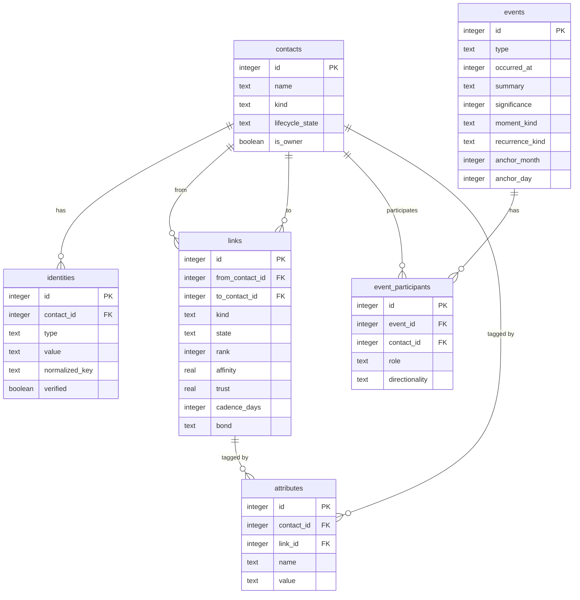
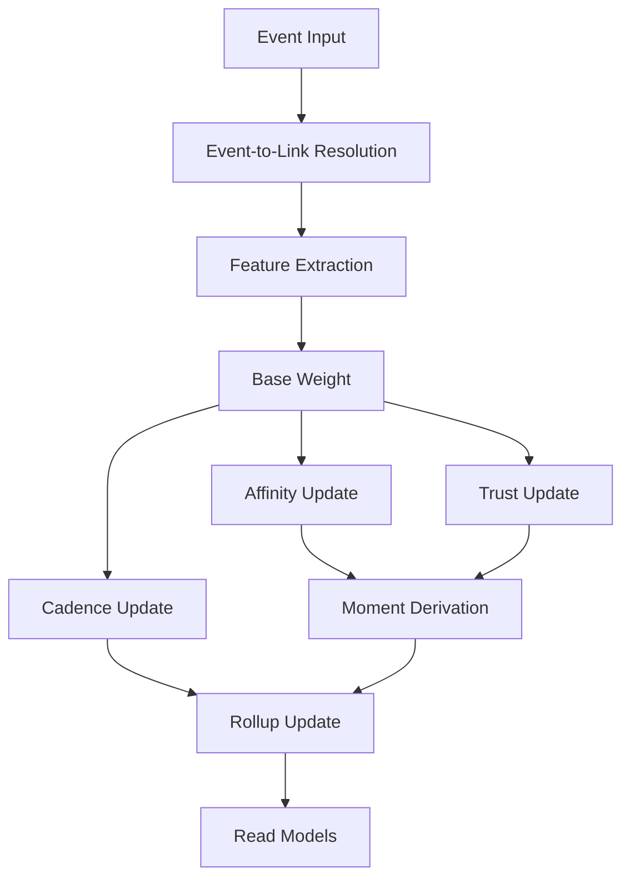

# Affinity — Architecture

Affinity is a standalone singleplayer social CRM core for personal contact
management, solo-business CRM, hybrid life CRM, and later Ghostpaw integration.

This document is the documentation hub: architecture, data model, mechanics,
invariants, and navigation. See `CONCEPT.md` at the repository root for the
full authoritative specification.

## Docs Guide

- [`HUMAN.md`](HUMAN.md): direct-code usage for human operators working with
  `initAffinityTables`, `read`, `write`, `types`, and `errors`
- [`LLM.md`](LLM.md): additive `soul`, `tools`, and `skills` runtime for
  harnesses
- [`USECASES.md`](USECASES.md): long-form lifecycle stories across personal,
  business, and AI-memory angles
- [`entities/`](entities/): concept manuals with exact public APIs inlined per
  entity

## Public Surface

Consumers interact with seven root entry points:

| Export | Purpose |
|---|---|
| `initAffinityTables(db)` | create all public and support tables |
| `read.*` | all query operations |
| `write.*` | all mutation operations |
| `types` | all public TypeScript types |
| `soul.*` | additive prompt-foundation runtime for operator posture |
| `skills.*` | additive harness-facing workflow guidance |
| `tools.*` | additive LLM-facing tool surface |

Everything flows through `node:sqlite`'s `DatabaseSync`. There is no ORM, no
async layer, and no external dependencies.

The direct-code surface remains the authoritative human API. The additive AI
runtime stack sits above it in three layers: `soul` for prompt-foundation
posture, `tools` for execution, and `skills` for reusable workflows built from
tools. Use `HUMAN.md` for direct library usage and `LLM.md` for the additive
runtime.

## Core Separations

The architecture enforces eight clean separations:

1. **Entity vs. Identity** — contacts say "who exists"; identities say "how do
   I recognize them"
2. **Evidence vs. Participation** — events say "what happened"; participants say
   "who was involved and how"
3. **Structural vs. Relational** — structural ties are declared facts;
   relational links carry live progression
4. **Intrinsic vs. Metadata** — entity columns are fixed; attributes are
   extensible key-value pairs
5. **Direct vs. Observed** — direct evidence carries full weight; observed and
   mention evidence is mechanically capped
6. **Derived vs. Declared** — rank, affinity, trust, cadence, and moments are
   computed from evidence, never caller-set
7. **Public vs. Support** — six public tables define the ontology; seven support
   tables accelerate reads and track internal state
8. **Write vs. Read** — writes are intention-shaped mutations; reads project
   derived truth without caller stitching

## Data Model

### Public Tables (6)



### Support Tables (7)

| Table | Purpose |
|---|---|
| `link_event_effects` | per-event per-link mechanics snapshot (the transparent math record) |
| `link_rollups` | materialized aggregate link metrics (drift, recency, positive event ratio, reciprocity) |
| `contact_rollups` | contact-level read acceleration |
| `contact_merges` | deterministic merge lineage |
| `upcoming_occurrences` | materialized next calendar occurrence for date anchors |
| `open_commitments` | unresolved promise/agreement tracking |
| normalized identity index | exact and fuzzy identity matching |

Support tables are invisible to normal callers. They exist to accelerate stable
public surfaces, track internal state, and avoid N+1 query patterns.

## Mechanics Pipeline

Evidence flows through a deterministic pipeline that computes all relationship
state:



1. **Event Input**: caller provides a `SocialEventInput` through an evidence
   write
2. **Event-to-Link Resolution**: participant shape determines which links are
   affected; auto-creates links when needed
3. **Feature Extraction**: derives `intensity`, `valence`, `intimacyDepth`,
   `reciprocitySignal`, `directness`, `preferenceMatch`, `novelty`
4. **Base Weight**: combines features with `type_weight`, `mass_penalty`, and
   `date_salience_bonus`
5. **Affinity/Trust/Cadence Updates**: applies the core formulas with repair
   bonus and heavy-usage protection
6. **Moment Derivation**: checks for breakthroughs, ruptures, reconciliations,
   milestones, and turning points
7. **Rollup Update**: refreshes materialized aggregates
8. **Read Models**: updated state is immediately available to all read queries

## Core Invariants

- exactly one `contacts.is_owner = true`
- identities may be reassigned by merge but must preserve lineage
- multiple links between the same pair are allowed when their kinds differ
- events never store participant columns directly
- event participants cannot exist without a parent event
- `moment_kind` is system-derived only
- `rank` is an integer floor at 0; automatic progression increases by at most 1
  per event and never decreases
- affinity is clamped to `[0, 1)` after carryover
- trust is clamped to `[0, 1]`
- observational-only evidence cannot raise rank above 1 or trust above 0.35
- structural links have no progression state
- `broken` links suppress automatic rank-up until the link is active again
- archived links are excluded from normal Radar and progression views
- all evidence writes, commitment operations, merges, and cascading lifecycle
  transitions are transactional
- mutation receipts reflect post-transaction truth
- list reads are N+1 safe

## Source Layout

```
src/
  index.ts              public barrel: initAffinityTables, read, write, types, soul, skills, tools
  soul.ts               additive prompt-foundation runtime for operator posture
  skills/               additive harness-facing workflow guidance
  read.ts               all read operations
  write.ts              all write operations
  types.ts              all public types
  tools/                additive LLM-facing runtime facade
  database.ts           AffinityDb type
  resolve_now.ts        time resolution helper
  with_transaction.ts   transaction wrapper
  init_affinity_tables.ts

  contacts/             contact CRUD and queries
  links/                link management, effects, rollups, radar
  events/               evidence intake, journal, moments, commitments
  dates/                date anchors, calendar, upcoming occurrences
  merges/               contact merge and lineage
  attributes/           metadata and preferences

  lib/
    formulas/           pure math functions
    types/              internal TypeScript types
    testing/            test helpers
  integration/          cross-cutting integration tests
```

## Entity Documentation

| Entity | Doc | Answers |
|---|---|---|
| Contacts | [entities/CONTACTS.md](entities/CONTACTS.md) | who or what exists? |
| Identities | [entities/IDENTITIES.md](entities/IDENTITIES.md) | how do I recognize or reach them? |
| Links | [entities/LINKS.md](entities/LINKS.md) | how do they relate? |
| Events | [entities/EVENTS.md](entities/EVENTS.md) | what happened? |
| Attributes | [entities/ATTRIBUTES.md](entities/ATTRIBUTES.md) | how do I categorize or operate on this? |
| Dates | [entities/DATES.md](entities/DATES.md) | when are the important recurring occasions? |
| Merges | [entities/MERGES.md](entities/MERGES.md) | which contacts are the same entity? |
| Graph | [entities/GRAPH.md](entities/GRAPH.md) | what does my network look like? |

If you need exact public calls for a specific concept, use the corresponding
entity manual.

## Use-Case Lifecycle Narratives

[USECASES.md](USECASES.md) contains 10 nontrivial day-by-day scenarios — from a
personal relationship keeper to a solo recruiter to an AI agent memory layer —
showing how each angle exercises the system from bootstrap to mature scale.
